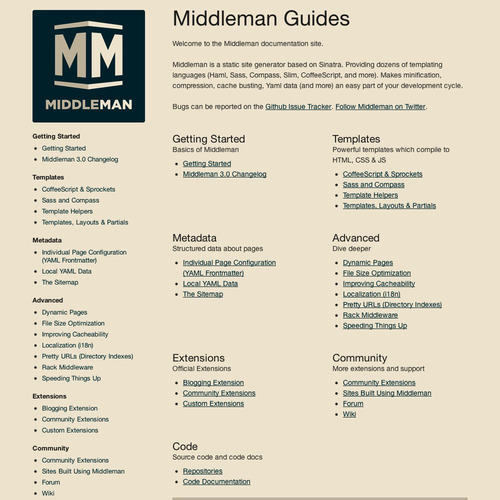
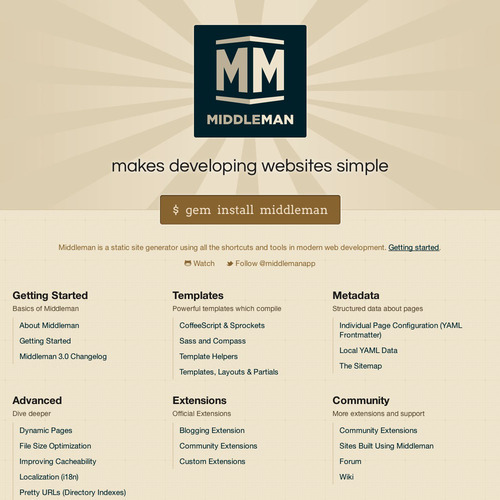

[Middleman](http://middlemanapp.com/) 是我很喜歡用的工具，在 7/9 發佈了 3.0 版。 我在Twitter看到消息後上官網看看有什麼新東西，結果看到了令人傻眼的首頁。

目錄為什麼要一模一樣放兩個地方啊&hellip; 所以我就拉了一張草稿，跟Middleman的作者確認他會喜歡後，把Github上網站的repository給fork回來，修改後再發pull request。

合理多了。然後我多學到了一些以前沒用過的Git指令。
