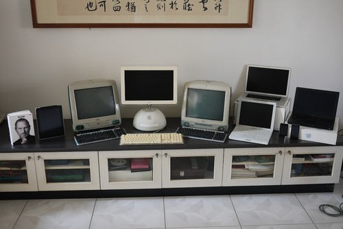

沒想到時間過得這麼快，賈伯斯已經過世一年了。但是，至今我仍然時常覺得他還活著。或許等到哪一天蘋果開始推出爛產品，我才會真正感覺到他已經走了吧。

跟大部份資深蘋果迷不一樣的地方是，我沒有經歷過沒有賈伯斯的時代。我是從iMac開始才愛上蘋果的。再加上我小時候用過的元祖麥金塔，等於我所有的蘋果產品都是賈伯斯的作品呢。

照片是我全部的蘋果產品大合照，每一台都有一個小故事可以講。比如說，初代iMac是我買便宜二手的，但是才用一個星期就爆了（當時很著名的主機板問題），等於是我第一次買Mac就上手買到機王啦。還有那台iBook，是因為那台LCD iMac放在學校宿舍，因為書桌靠窗，宿舍防水沒做好，一個颱風天就泡水壞了，所以賠償我全額買的。

還有那台黑色MacBook，原本我是買白色的，但是在Oikos居然剛好看到有人想黑色換白色，因為他覺得「黑色實在不太像Mac」，所以我算是賺到了。還有算不上故事，現在還在用的MacBook Pro，是透過親戚用員工價七折買的，超爽的。

從iMac開始，蘋果或多或少影響了我的一生吧。因為用Mac，我才會關心網頁在跨平台時的問題，成為我現在網頁工作的基礎。雖然很多人覺得這事賈伯斯的失策，但是也因為iMac主打功能DV剪輯，我才會買台DV來玩，也才開始玩攝影（相機）。有玩攝影後，我才得以用「服飾攝影」從織品系畢業，也因為拍這組畢業作品，我才得以認識我的太太。沒有iMac，我的人生會很不一樣吧

