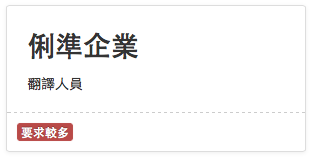
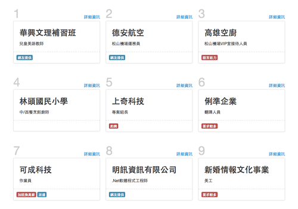
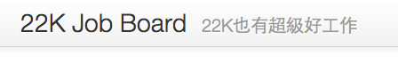
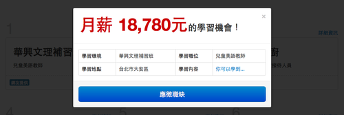
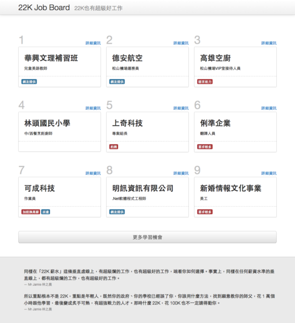

[揭露22K](http://22kopendata.org) 這個網站上線後，原本我是覺得這麼做沒什麼意義，因為22K職缺上104搜尋，認識在Google搜尋馬上可以看到一堆，沒有什麼必要再做一個站搜集。但是沒想到引起的迴響還蠻大的，還有幾個媒體報導，而且最大的指標還是居然真的有公司要**提告**了！這真是又證明了除了內容，形式的影響力也是非常大的，完全打中了台灣人「愛面子」的要害。

不過明顯的網站還是有濃濃的工程師風格，雖然在bootstrap的幫助下，外觀還蠻順眼的，但是由於資料是由表格呈現的，毫無輕重緩急之分，多看了幾次後覺得實在有點無趣。所以我開始思考，要怎樣才能把這個網站設計得更好？

1. 
首先是我問我自己，我來看這個網站，要看的到底是什麼？公司名稱，地址，職位名稱，薪資之中，我要看的只有「公司名稱」，其次是「職位名稱」而已。薪資一定是18K~22K附近，而「相關資料」裡面只是證據而已。所以，應該要這樣來呈現一筆資料：

H2M_LI_HEADER 
我網頁上要呈現幾筆資料？其實每次來看，最重要的是要來看看有哪些新面孔。一次把全部列出來，也很容易讓新上榜的公司很不顯眼。所以大概放個十個上下就好了吧，為了grid整齊就決定是9個。

H2M_LI_HEADER 
最後我在想，其實我看 22kopendata.org 的時候，心情其實還蠻輕鬆的，沒有很沈重或是憤怒的感覺，可能是因為我自己跟22K還有些距離吧。所以想說還是走輕鬆路線好了。而且，我也是蠻怕網站以攻擊資方的角度設計的話被告的，所以我要以正面的意念來設計這個網站！所以就以22K正方Jamie的話「22K也是有超級好工作的」來當設計主軸了。

H2M_LI_HEADER 
最後，每個職缺都可以在 lightbox 視窗檢視詳細資訊，這個詳細資訊我設計得非常正面，還有一個應徵職缺的按鈕，方便使用者如果發現這個22K是超級好工作的話，馬上到104去應徵！

H2M_LI_HEADER 
最後，網站最下面點綴一些Jamie的名言謹句，平衡整個網站，就大致完成這次的初步設計了。

[大圖](http://cl.ly/MYg9/22K%20Job%20Board.png)

雖然說我是看到 [http://22kopendata.org](http://22kopendata.org) 釋出了API才突然想設計一下的，但是我只會處理JSON啊啊&hellip;

所以如果有任何人覺得我個設計點子不錯，都歡迎[下載](http://cl.ly/MYmn) css template 回去實作接API資料囉。
