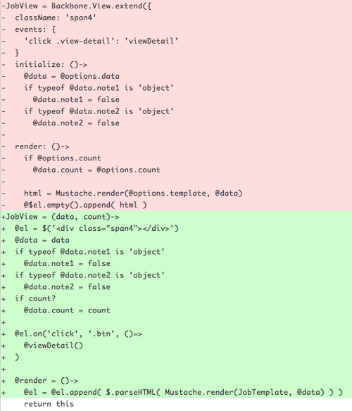

在設計完22K學習銀行的概念之後，雖然抱怨[揭露22K](http://22kopendata.org)不提供JSONP API，但是還是自己寫一下proxy把網站架起了（這麼剛好有[教學](http://www.sitepoint.com/php-xml-to-json-proxy/) ）。

寫這個搞笑網站的過程有學到一點東西，就是我第一次實作了JavaScript的物件XD。一開始網站本來是用Backbone.View在做那些卡片，但是寫完後看到看Backbone只用一次，卻要拉Backbone附帶underscore**感覺**真是太累贅了。經過熱情網友的教學後終於成功改寫了。

不過話說回來，其實22K議題應該是和網頁設計師無緣啦，只要你有合格的視覺設計能力，加上會寫HTML/CSS，就該有33K上下了。如果會寫jQuery或是直接寫（ex. php）template，不是44K左右大概可以開始找新工作了。那如果你還會最先進的技術像是Responsive Design之類的，遇到對的——有需求——的僱主或是客戶，破55K應該不成問題才對。
