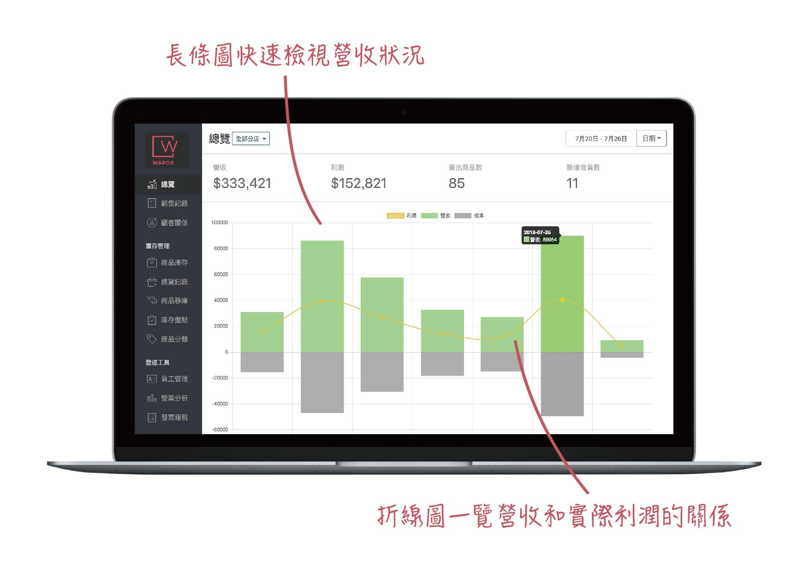
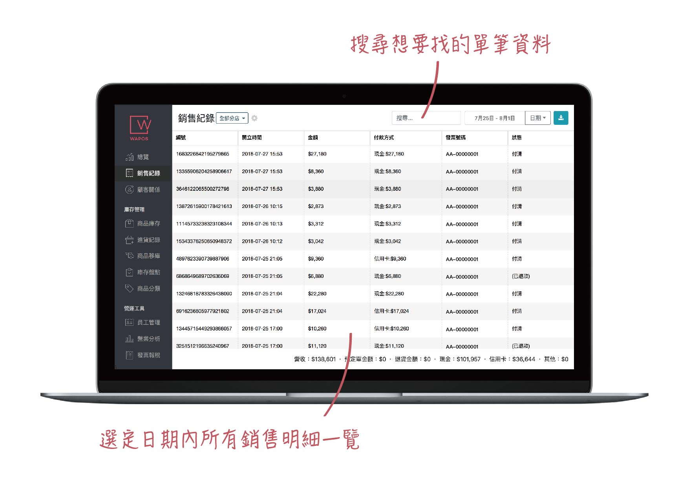
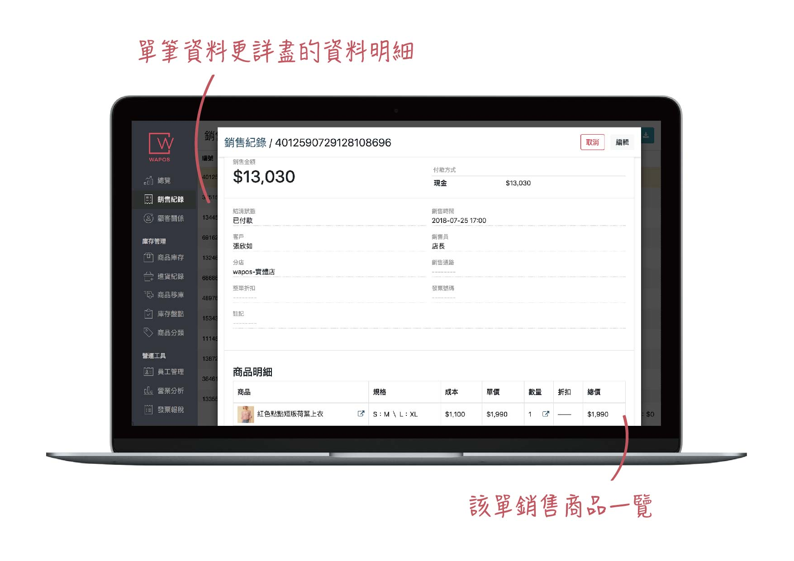
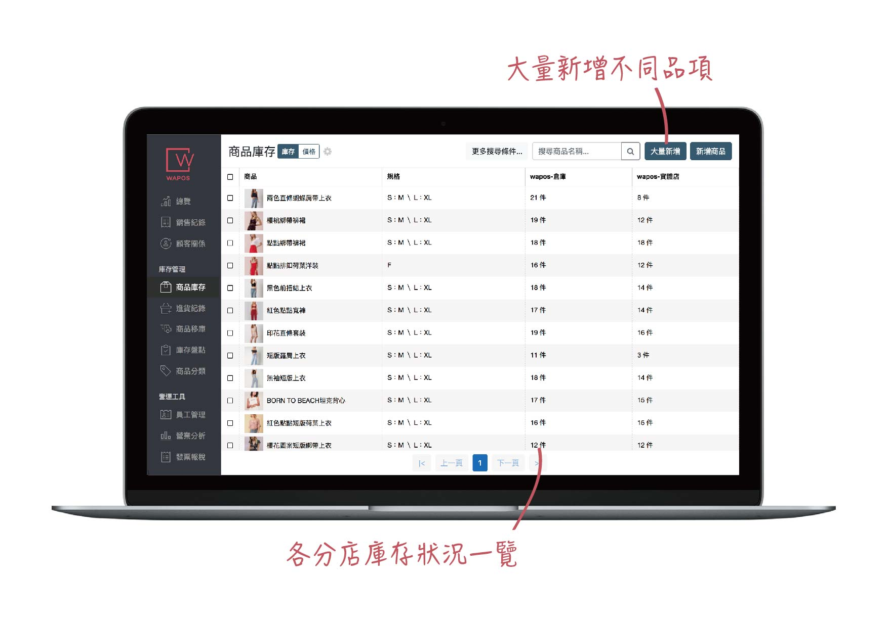
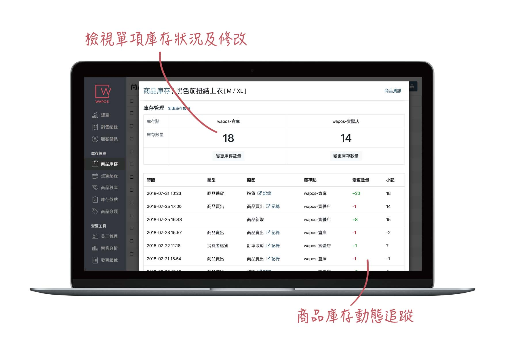
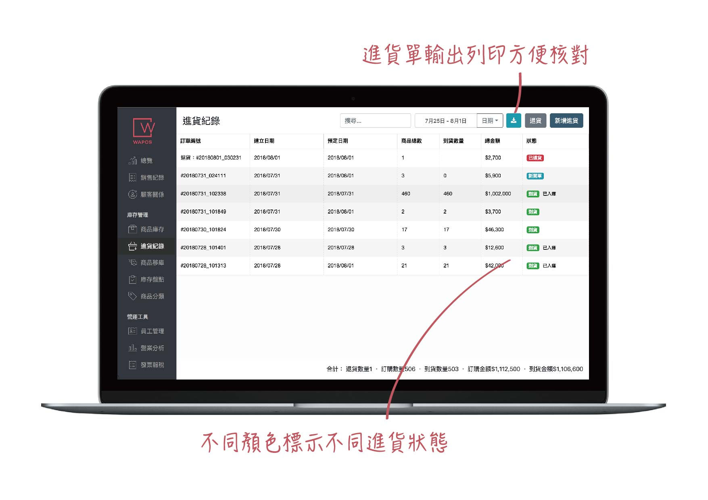

這個心得呢，是因為公司（WAPOS）在這個月被賣掉了，產品的開發已經移交給新公司的團隊，所以趁還有記憶的時候做個總結，不然以後都忘光光就後悔也來不及了。

我負責開發的是管理後台，非常典型的管理後台。任務就是CRUD商品、訂單、庫存等等所有商家都會有的資訊。基本上沒有什麼複雜的功能，目標是提供給商家最好的UX，順暢的管理他們的資料。我們有研究過同類型產品的後台，大多一看就是停在10年前的風格，所以也是希望能用跟得上時代的設計吸引到客戶。

這段兩年多的開發經驗很可能是我這輩子最愉悅的，以後不大可能有同樣的機會了。這是因為大部分的事情我可以決定，不太需要顧慮什麼。比方說技術的選擇。另外，library 的版本也是想升就升，例如我看到 `react-router v4` 的新寫法，馬上就覺得超棒，立刻就升級改寫法。這也是非常快樂。

我前端技術選擇的主幹是 React + MobX 。MobX 的好處是讓我開發時寫的 code 比用 Redux 少很多，壞處是要讓 MobX 的 magic 有作用，有一些細節要注意，而且其實會感覺比較在寫Vue，而不是正統 React。甚至 MobX 的 obserable 物件可以同時 import 到不同的 React Component 裡去，component之間要共用 state 不用靠 context。

也因為跟主流的寫法不同，我一直覺得我用 React + MobX 寫的 code 很不乾淨，component 裡面有個物件從裡面操控很奇怪，所以一直想換成 Redux。直到 Hooks 的出現， Hooks 也是從「裡面」控制 component 的感覺，我不舒服的心結才打開。

我們是小小的新創團隊，只有 2 個人力在寫這個後台。我的夥伴負責 DevOps的部分，而我只需要專心寫前端，不用管（我完全不懂的）server。也因為這麼少的人力，我們是能「外包」就外包。

除了很一般的用很多 open source library ，像是 Bootstrap ，我們也買了一些不便宜的UI，像是[ag-grid](https://www.ag-grid.com/) 。作為一個管理後台，對資料清單的操作可以說是核心的功能， ag-grid 很好的滿足了我們的需求。另外，使用者登入我們用 [auth0](https://www.auth0.com/)，圖片的縮圖我們用
[imgix](https://www.imgix.com/)，這些都節省了我們很多時間。

其實，更大的挑戰是，我還有正職工作。WAPOS 這邊，我只有在下班後的時間才能開發，一天只有3 ~ 4個小時，週末有沒有時間不一定。所以，可以說是沒有一分鐘可以浪費。幸好的是，當開發的人只有一個人時，有很多有利的條件，讓我一個人開發的速度能跟一個小團隊不相上下。

大家比較熟知的是可以節省大量的溝通時間。開會，寫文件都不必了。我們唯一而且重要的開發文件是 DB schema。除了省下溝通時間以外，一人開發在每個環節都可以選用最方便的方式開發，「互相配合」。例如，後台吐的資料結構，可以設計成最方便前端使用的。

設計師跟前端工程師的配合也是如此。設計師的設計，往往最多能配合到工程師「做得出來」，當設計處在做得出來但是有點麻煩的狀態下，是不會要設計師改設計的。另外，設計師也往往想嘗試新設計，不會嚴格只使用現有的UI元件，這時工程師就又不能使用以前寫好的東西了。

因為這個後台的設計師就是我，所以上述浪費時間的狀況就當然不會出現了。我是直接用 Bootstrap 的元件去排，設計完成時就是實作完成。不但省下畫設計圖的時間，實作不方便的設計也沒有機會出現。

現在，這段旅程已經告一段落。對我來說，實作別人的設計不如自己做設計開心。不過我的設計能力當然是不如專業的設計師，所以是不會有機會領薪水這樣做的，這段開心的經驗，也只能放在回憶裡了。
